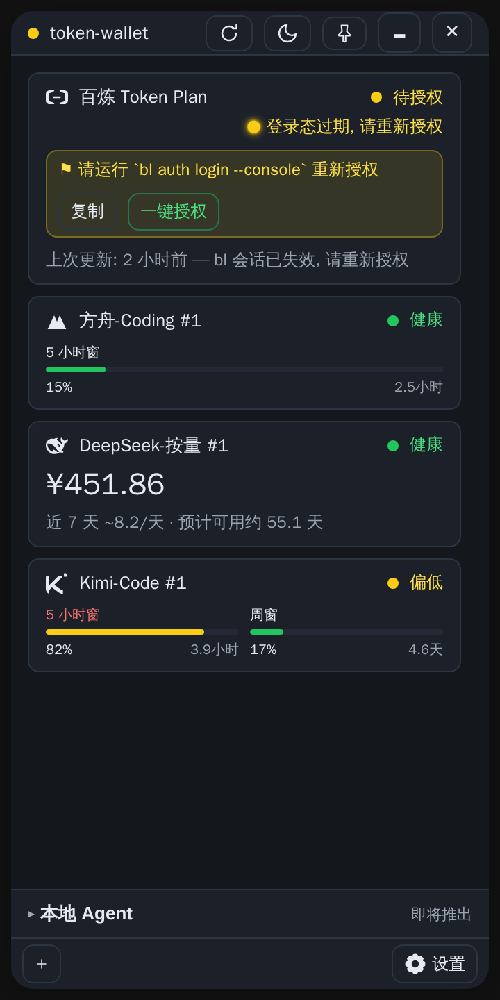
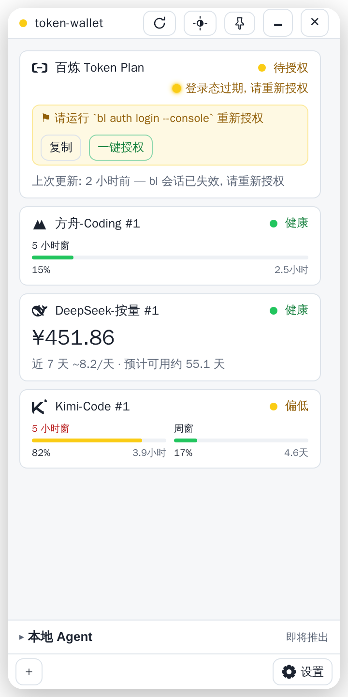

<div align="center">

# 💳 token-wallet

**All your AI quota, at a glance.** Don't let a three-hour task chain die because one platform's quota silently ran out.

[](LICENSE)
[](https://www.electronjs.org/)
[](https://react.dev/)
[](#supported-channels)
[](https://github.com/donald2008/token-wallet)
[](https://github.com/donald2008/token-wallet/actions/workflows/ci.yml)
[](README.md)

**DeepSeek · Kimi · opencode · Zhipu GLM · MiniMax · Alibaba Bailian · Volcengine Ark** — quota
windows from seven AI platforms in a single 360px desktop widget: progress bars, reset
countdowns, and "days remaining" estimated from your consumption rate.

> **The silent bomb of the multi-agent era**: token spend is scattered across plans — 5-hour
> rolling windows, weekly windows, monthly windows, prepaid balances. Your long-running job
> dies at 3 a.m. and you only find out after digging through terminals: one platform's quota
> ran out two hours ago. **token-wallet deletes this failure mode from your workflow.**

| Dark | Light |
|------|-------|
|  |  |

**Paste a key and go (HTTP channels) · One-click authorize (CLI channels, auto-opens browser) · Zero telemetry · Data never leaves your machine**

</div>

## Why token-wallet

- **Read at a glance** — tray dot = global worst status; the popup panel shows remaining quota and countdowns for every window without opening a single provider console
- **Early warning** — extrapolates "days remaining" from recent consumption rate; cards change color before quota runs out, not after
- **Failures are explicit** — invalid key / missing CLI / expired session: the card tells you exactly how to fix it, never shows fake data
- **Cache-first** — snapshots land in local SQLite; numbers appear on launch, readable offline, UI never waits on the network
- **Engineering restraint** — adding a channel = registering one declarative mapping, zero scripts, zero eval; credentials only ever touch the OS keychain

## What problem it solves

In multi-agent workflows, token consumption is spread across multiple providers and plan
types (5-hour rolling / 7-day / monthly / prepaid balance). When any platform quietly runs
dry, running task chains break. token-wallet consolidates remaining quota, window reset
countdowns, and consumption rates into one desktop widget — readable at a glance.

## Architecture

```text
  ┌────────────────────────────────────────────────┐
  │             Electron desktop widget (app)      │
  │  Tray + popup panel (React 19) · Settings ·    │
  │                  Add wizard                    │
  └───────────────┬────────────────────────────────┘
                  │ read-only local cache (cache-first, offline OK)
  ┌───────────────▼────────────────────────────────┐
  │              StorageBackend (SQLite)            │
  │  history snapshots → consumption rate / days    │
  └───────────────▲────────────────────────────────┘
                  │ background polling (per-instance scheduler)
  ┌───────────────┴────────────────────────────────┐
  │           Adapter layer (core)                  │
  │  http direct (DeepSeek/Kimi/opencode/Zhipu)     │
  │  command CLI wrappers (Bailian bl / Ark arkcli) │
  └────────────────────────────────────────────────┘
```

- UI always renders from local cache: numbers on launch, zero network wait, offline-capable
- Per-instance independent polling: concurrency, fault isolation, hard timeout, exponential backoff
- Explicit failures: invalid key / missing CLI / expired session → card shows a concrete fix
- Credentials in OS keychain; config files store references only (see docs/DESIGN.md)

## Features

- Built-in channels for seven platforms; paste a key — or log in once via the official CLI — and go
- One unified view for three plan archetypes: window-based (multi-window progress bars + reset countdowns) / balance-based (balance + estimated days left)
- CLI channels one-click authorize: tap "Authorize" in the app, browser opens by itself — never touch the command line
- Resident system tray; 360px popup panel; tray dot = global worst status
- Card filtering (all / available / abnormal) + three sortings (name / urgency / drag to reorder)
- Explicit failures: invalid key, missing CLI, API changes all produce a readable card with fix instructions — never fake data
- Cache-first: snapshots to local SQLite; last-known data visible offline
- Credentials in the OS keychain (Windows Credential Manager); config files never hold secrets
- Dark / light themes follow the system by default, manual override available
- Zero telemetry, zero reporting, data stays on your machine (privacy notice on first launch)

## Supported channels

| Platform | Product | Billing type | Access | What you need |
|----------|---------|--------------|--------|---------------|
| DeepSeek | Pay-as-you-go | Balance | Official API | API Key |
| Kimi (Moonshot) | Coding | Window | Official API | API Key |
| opencode | Go Coding | Window | Official API | API Key |
| Zhipu bigmodel | GLM Coding Plan | Window | Official API | API Key |
| MiniMax | Token Plan | Window (5h + weekly) | Official API | Token Plan key (`sk-cp-` prefix) |
| Alibaba Bailian | Token Plan | Window | Official CLI `bl` | No key; log in once |
| Volcengine Ark | Coding Plan | Window | Official CLI `arkcli` | No key; SSO once |

> MiniMax (pay-as-you-go), Meituan LongCat, opencode zen balance are planned (docs/DESIGN.md §5.2).
> Adding a channel = registering a declarative mapping in the channel registry, zero code
> for standard APIs; complex APIs use a TS adapter.

Channel-level prerequisites: the two CLI channels need the official CLI installed (the
in-app card shows install instructions); all other channels work with an API key:

| Channel | Extra dependency | Authorization |
|---------|------------------|---------------|
| Alibaba Bailian | `bl` CLI | `bl auth login --console` — browser login once |
| Volcengine Ark | `arkcli` CLI (`npm i -g @volcengine/ark-cli`) | `arkcli auth login volc-sso --no-browser` — device-code login |

## Repository layout

```text
token-wallet/
├── packages/
│   ├── core/             collection core (pure TS lib): adapter registry / scheduler / cache / schema
│   ├── app/              Electron desktop widget (React 19): tray + popup + settings
│   └── mcp-server/       MCP data-plane daemon (planned, embeds core)
├── docs/                 DESIGN (architecture) / DECISIONS / RELEASE (release manual)
├── scripts/              Windows build scripts
├── sketches/             UI visual mockups (for review, can be discarded)
└── package.json          pnpm workspace
```

## Install

### Download the installer (recommended)

Current version **v0.2.6**, stable link (always points to the latest stable release, updated on every release):

```text
https://gitee.com/ITEater/token-wallet/releases/download/stable/token-wallet_setup.exe
```

- Windows 10/11 x64; single-file fully-offline installer (~93 MB, bundles Chromium runtime, no external dependencies)
- Platform note: **officially supported on Windows** today. macOS / Linux are code-ready
  (credentials via system safeStorage, platform-derived paths) but no installers are
  published and no real-machine validation has been done — see [Roadmap](#roadmap)
- Verify: compare the installer against `SHA256SUMS.txt` in the Release assets
- First install: the installer is not code-signed; when SmartScreen says "Unknown publisher",
  click "More info" → "Run anyway" (expected behavior; signing is planned)
- Auto-update: built-in updater (uses the public gitee source since v0.2.4) — once installed,
  new versions are one-click from the Settings page, no manual re-download

### Run from source

Prerequisites (any form needs these):

| Dependency | Version | Purpose |
|------------|---------|---------|
| Node.js | ≥ 22 | run / build (pnpm aligned via corepack) |
| pnpm | ≥ 9 (auto via corepack) | package manager |
| Windows 10/11 x64 | — | desktop widget platform |

No native module compilation; no Rust / Visual Studio / WebView2 toolchains.

```bash
# CN: primary repo on gitee ｜ overseas: GitHub mirror github.com/donald2008/token-wallet
git clone git@gitee.com:ITEater/token-wallet.git
cd token-wallet
node start-dev.mjs           # env check → install deps → launch Electron dev shell
```

Or step by step:

```bash
pnpm install
pnpm dev        # Electron dev shell
pnpm dev:web    # browser preview only (no main process → no keychain/SQLite)
```

On Windows double-click `start-dev.cmd`; `node start-dev.mjs --check` only checks the environment.

### Build the Windows installer

```bash
pnpm build:win    # = pnpm -r build + electron-builder NSIS
```

Output: `packages/app/release/token-wallet_<version>_setup.exe`. The packaging chain is
pure Node tooling (electron-builder) — no Rust / Visual Studio / WebView2 needed; see
[RELEASE.md](RELEASE.md) for the full release manual.

## FAQ

**Q: SmartScreen blocks the install?**
Expected for an unsigned app: "More info" → "Run anyway".

**Q: Where do I get API keys?**

| Platform | Where |
|----------|-------|
| DeepSeek | platform.deepseek.com → API Keys |
| Kimi Coding | platform.moonshot.cn → open platform → API Key (Coding plan) |
| opencode | opencode.ai → account Settings → API Keys (zen/go plans) |
| Zhipu bigmodel | bigmodel.cn → API Keys (Coding Plan key; same as the coding inference key) |

**Q: How do I authorize Bailian (bl)? Why a CLI?**
Bailian's usage API only accepts control-console login sessions (managed by the official CLI
`bl`), not API keys. When you add a Bailian instance, the app detects whether `bl` is on
PATH; if missing, the card shows install instructions — install the official CLI and restart.
Then run `bl auth login --console` and complete browser login. Sessions are server-side
time-limited (empirically a few days); when expired, the card turns yellow with re-login instructions.

**Q: How do I authorize Volcengine Ark (arkcli)?**
Ark uses the official CLI's SSO device-code flow: `arkcli auth login volc-sso --no-browser`,
then complete verification in the browser. If the CLI is missing, the card shows
`npm i -g @volcengine/ark-cli`; install, restart, done. When the session expires, the card
turns yellow with re-login instructions.

**Q: What does a yellow/red card mean?**
Yellow = needs attention (quota low or credentials expired; the card carries the exact fix
command, one click to copy). Red = abnormal or quota exhausted; gray = not configured.
Hover a window progress bar to see remaining quota and reset time.

**Q: Are my keys and usage data safe?**
Keys live in the OS keychain (Windows Credential Manager); config files store references,
never plaintext. Snapshots land in local SQLite. The app has no telemetry/reporting code;
the only network requests are to the official endpoints of channels you added on the Settings page.

## Docs

- [docs/DESIGN.md](docs/DESIGN.md) — architecture & design (two-layer channel model / adapter system / scheduling / UI)
- [docs/DECISIONS.md](docs/DECISIONS.md) — decision records (each with empirical evidence)
- [TESTING.md](TESTING.md) — test matrix and how to run
- [RELEASE.md](RELEASE.md) — release manual

## Roadmap

### Near term

- MiniMax pay-as-you-go balance channel (`sk-api-` key; `query_balance` endpoint proven)
- Volcengine Ark expansion: free quota / media-asset views (usage balance control-plane commands)

### Mid term

- MCP data plane: local Agent token consumption view + "cloud × local" comparison (mcp-server daemon)
- Meituan LongCat, opencode zen pay-as-you-go channels

### Long term

- Code signing (remove SmartScreen warning), CI automation, GitHub mirror
- macOS / Linux installers: code-ready (safeStorage / derived paths), needs real-machine validation before publishing

Full channel-level plan: [docs/DESIGN.md §5.2](docs/DESIGN.md).

## License

[Apache License 2.0](LICENSE)