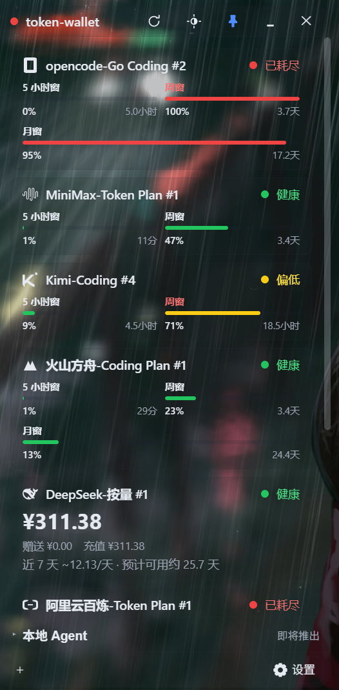
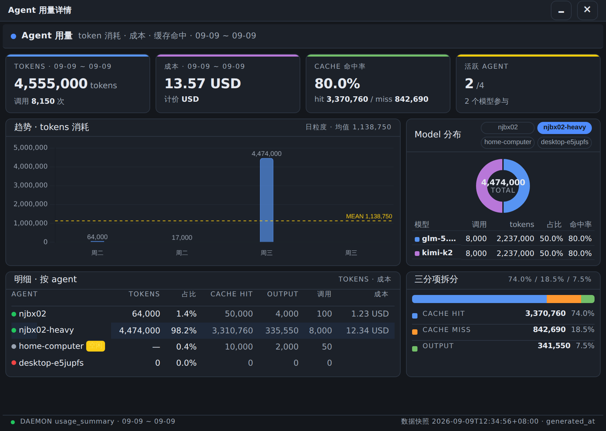
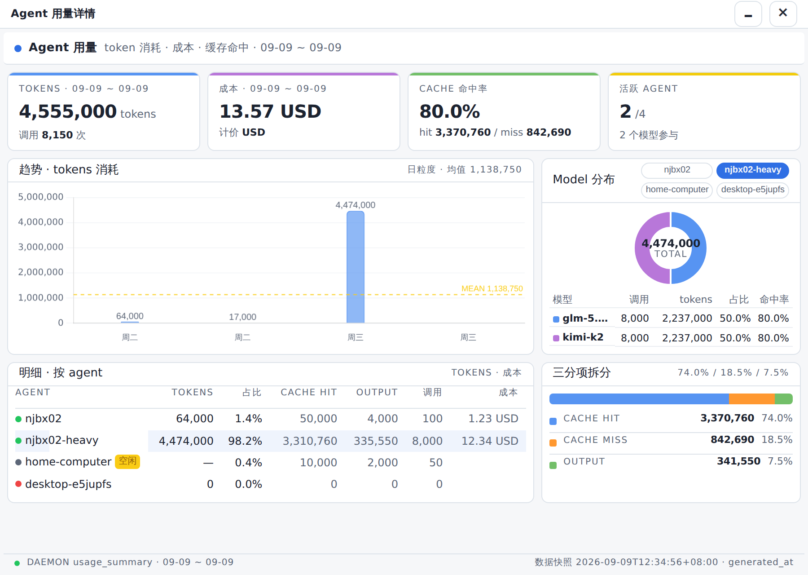
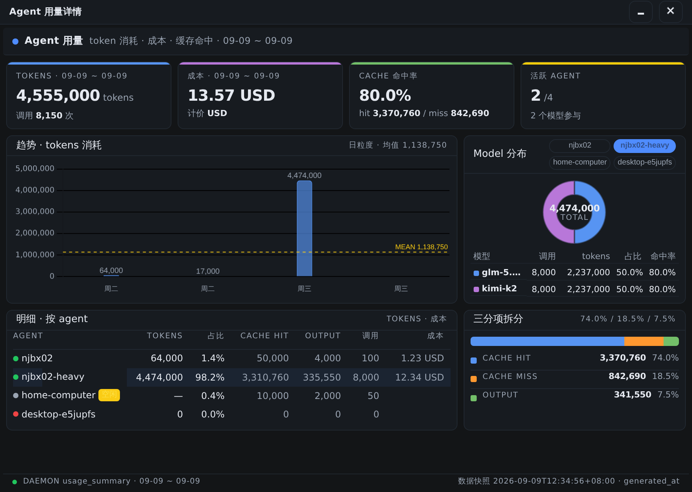

<div align="center">

# 💳 token-wallet

**你的 AI 额度，一瞥即知。** 别再让跑了三小时的任务链，死于一家平台的配额悄悄清零。

[](LICENSE)
[](https://www.electronjs.org/)
[](https://react.dev/)
[](#支持的通道)
[](https://gitee.com/ITEater/token-wallet)
[](README.en.md)

**DeepSeek · Kimi · opencode · 智谱 GLM · MiniMax · 阿里云百炼 · 火山方舟** —— 七家 AI 平台的
额度窗口，收进一枚 360×720px 的桌面部件：进度条、重置倒计时、按消耗速率估算的「还能用几天」。

> **多 Agent 时代的隐形炸弹**：token 消耗散落在各家套餐里 —— 5 小时滚动窗、周窗、月窗、按量余额。
> 深夜的长任务挂了，你翻遍终端才发现：某家的额度两小时前就没了。**token-wallet 把这种死法从你的工作流里删除。**

| Dark | Light | Glass |
|------|-------|-------|
|  |  |  |

**本地 Agent 用量大屏**（实时 token 消耗 / 成本 / 缓存命中 — Dark / Light / Glass）：

| 大屏 Dark | 大屏 Light | 大屏 Glass |
|------|------|------|
|  |  |  |

**填 Key 即用（HTTP 通道）· app 内一键授权（CLI 通道，自动打开浏览器）· 零遥测 · 数据不出本机**

</div>

## 为什么是 token-wallet

- **一瞥可读** —— 360×720 的紧凑面板直接看每个窗口的剩余与倒计时，不打开任何一家控制台
- **提前预警** —— 按近期消耗速率外推「预计可用天数」，额度临近耗尽提前变色，不是事后报错
- **异常显式化** —— key 失效 / CLI 缺失 / 会话过期，卡片直接告诉你怎么修，绝不显示假数据；火山方舟 SSO 失效时卡片自动弹出「请重新授权」按钮
- **三种排版自适应** —— row/duo/hero/micro/ticker 容器，按窗口宽度自动切换（micro 形态下百分比常驻直显）
- **玻璃主题可选** —— 设置页「外观」区可切换玻璃主题，拖动透明度滑槽实时调档，0-100% 停即存
- **手动排序 = 拖拽 = 用户接管** —— 拖卡片浮起即接管排序，松手一次持久化，不引拖拽库
- **cache-first** —— 快照落本地 SQLite，启动即出数、断网可看，UI 永远不等网络
- **工程克制** —— 接新通道 = 声明式注册一份映射，零脚本零 eval；凭据只进 OS 钥匙串

## 解决什么问题

多 Agent 工作流下，token 消耗分散在多家 provider 的多类套餐里
（5 小时滚动窗 / 7 天窗 / 月度额度 / 按量余额）。任一平台额度悄悄耗尽，
正在执行的任务链就会中断。token-wallet 把所有套餐的剩余量、窗口重置倒计时、
消耗速率集中到一个桌面部件上，一瞥可读。

## 架构

```text
  ┌────────────────────────────────────────────────┐
  │                Electron 桌面部件 (app)          │
  │  弹出面板 360×720 (React 19)  ·  设置页 · 添加向导 │
  └───────────────┬────────────────────────────────┘
                  │ 只读本地缓存 (cache-first, 断网可用)
  ┌───────────────▼────────────────────────────────┐
  │              StorageBackend (SQLite)            │
  │   历史快照 → 消耗速率 / 预计可用天数             │
  └───────────────▲────────────────────────────────┘
                  │ 后台轮询写入 (每实例独立调度循环)
  ┌───────────────┴────────────────────────────────┐
  │      适配器层 (core / packages/core)            │
  │  http 直连 (DeepSeek/Kimi/opencode/智谱)        │
  │  command CLI 包装 (百炼 bl / 火山 arkcli)        │
  └────────────────────────────────────────────────┘
```

- UI 永远从本地缓存渲染：启动即出数，零网络等待，断网可用
- 每实例独立采集循环：并发、故障隔离、超时硬切断、失败指数退避
- 异常显式化：key 失效 / CLI 缺失 / 会话过期 → 卡片给出明确修复指引
- 凭据存 OS 钥匙串，配置文件只存引用（详见 docs/DESIGN.md）

## 功能特点

- 展示七家平台内置通道的额度余量，填 Key（或 app 内一键授权官方 CLI）即用
- 统一视图呈现三种套餐原型：窗口制（多窗进度条 + 重置倒计时）/ 余额制（余额 + 预计可用天数）
- CLI 通道 **app 内一键授权**：卡上点「授权」即弹出 OneClickAuth 面板，打开浏览器完成登录；完成态按钮点击 = 触发刷线（D-048），整个流程不碰命令行
- 360×720px 紧凑面板；多窗口实例自动按 `P5MonitorShortSide` 排版：5h+周同一行两列，月窗全宽独立行
- 卡片过滤（全部 / 可用 / 异常，icon 钮组绝对定位浮卡片列表右上角）
- **手动拖拽排序**：拖卡浮起即接管排序，松手一次持久化；v0.2.8 起三档命名排序已收敛至「只手动」（D-039 + t_d086543b）
- 排版变体：`row` / `duo` / `hero` / `micro` / `ticker` 五种容器形态自动适配窗口宽度；micro 形态下百分比常驻直显
- 玻璃主题 + 透明度滑槽：设置页「外观」区可独立开关玻璃主题，0-100% 滑槽拖即变停即存
- 删钮：卡 head 右上常显；hover 激活热区，点击弹气泡二次确认（防误删）
- 异常显式化：key 失效、CLI 缺失、接口变更都给明确卡片与修复指引，绝不显示假数据
- 火山方舟 SSO 失效自愈：所有锁竞争/会话失效 body 统一走 `auth_expired` 一键授权，不再判 stale 卡死用户
- cache-first：快照落本地 SQLite，断网可看最后一次数据
- 凭据存 OS 钥匙串（Windows 凭据管理器 / macOS Keychain），配置文件永不落密钥
- dark / light / glass 三主题；主题默认跟随系统，支持手动切换
- 中英双语：设置页「语言」分段控件切换 zh/en，重启保持
- 零遥测、零上报、数据不出本机（首开须同意隐私声明）

## 支持的通道

| 平台 | 产品 | 计费形态 | 接入方式 | 需要什么 |
|------|------|----------|----------|----------|
| DeepSeek | 按量余额 | 余额制 | 官方 API | API Key |
| Kimi (Moonshot) | Coding | 窗口制 | 官方接口 | API Key |
| opencode | Go Coding | 窗口制 | 官方 API | API Key |
| 智谱 bigmodel | GLM Coding Plan | 窗口制 | 官方 API | API Key |
| MiniMax | Token Plan | 窗口制（5h + 周窗） | 官方 API | Token Plan 订阅 Key（`sk-cp-` 前缀） |
| 阿里云百炼 | Token Plan | 窗口制 | 官方 CLI `bl` | 免填 Key，登录一次 |
| 火山方舟 | Coding Plan | 窗口制 | 官方 CLI `arkcli` | 免填 Key，SSO 登录一次 |

> MiniMax（按量余额）、美团 LongCat、opencode zen 按量余额在规划中（见 docs/DESIGN.md §5.2）。
> 接新通道 = 通道目录声明式注册，映射零代码（标准接口）；复杂接口用 TS 适配器。

通道级前置：两个 CLI 通道需要额外装官方 CLI（首次添加实例时 app 内一键安装流程会给出指引，D-023），
其余通道填 API Key 即用：

| 通道 | 额外依赖 | 授权方式（app 内一键） |
|------|---------|----------------------|
| 阿里云百炼 | `bl` CLI（首次添加实例时一键安装） | 卡上点「授权」→ 浏览器打开百炼控制台完成登录；CLI 会话由服务端时效控制（经验数天），过期后卡片转黄并提示重新授权 |
| 火山方舟 | `arkcli` CLI（首次添加实例时一键安装） | 卡上点「授权」→ 火山 SSO 设备码两段式浏览器验证；CLI 会话由服务端时效控制，过期后卡片转黄并提示重新授权（**火山 SSO 失效自助恢复路径，详见 [USER_GUIDE.md](docs/USER_GUIDE.md)**） |

> **CLI 通道已不再需要手动跑命令行**：v0.2.8 之前在终端执行 `bl auth login --console` 或 `arkcli auth login volc-sso --no-browser` 的步骤，现在统一由 app 内 OneClickAuth 面板代理；命令行兜底仅在 app 内面板异常时使用，详见 [USER_GUIDE.md §4](docs/USER_GUIDE.md)。

## 仓库结构

```text
token-wallet/
├── packages/
│   ├── core/             采集核心（纯 TS 库）：适配器注册表 / 调度器 / 缓存 / schema
│   ├── app/              Electron 桌面部件（React 19）：托盘 + 弹出面板 + 设置
│   └── mcp-server/       MCP 数据面 daemon（规划中，内嵌 core）
├── docs/                 DESIGN（架构）/ DECISIONS（决策）/ RELEASE（发版手册）
├── scripts/              Windows 构建脚本
├── sketches/             UI 视觉 mockup（评审用，可丢弃）
└── package.json          pnpm workspace
```

## 安装

### 下载安装包（推荐）

当前版本 **v0.2.8**，稳定版直链（始终指向最新稳定版，发版自动更新）：

```text
https://gitee.com/ITEater/token-wallet/releases/download/stable/token-wallet_setup.exe
```

- Windows 10/11 x64，单文件全离线安装包（~93 MB，含 Chromium 运行时，无外部依赖）
- 平台说明：当前**官方支持 Windows**；macOS / Linux 的代码层已兼容（凭据走系统
  safeStorage，路径按平台派生），但未发布安装包、未经真机验收——见 [Roadmap](#roadmap)
- 校验：Release 附件中的 `SHA256SUMS.txt` 与安装包比对
- 首次安装：安装包未做代码签名，SmartScreen 提示「未知发布者」时点
  「更多信息」→「仍要运行」即可（预期行为，签名将在后续版本解决）
- 自动更新：v0.2.0+ 内置 `electron-updater` 自动更新（D-046，更新源 = gitee stable
  `https://gitee.com/ITEater/token-wallet/releases/download/stable/`），启动静默 check only；
  下载与安装始终用户点击触发，详见设置页「关于」区

### 从源码运行

前置依赖（任一形态都需要）：

| 依赖 | 版本 | 用途 |
|------|------|------|
| Node.js | ≥ 22 | 运行 / 构建（pnpm 由 corepack 自动对齐） |
| pnpm | ≥ 9（corepack 自动） | 包管理 |
| Windows 10/11 x64 | — | 桌面部件运行平台 |

无需原生模块编译，无 Rust / Visual Studio / WebView2 工具链。

```bash
# 国内：gitee 主仓 ｜ 海外：GitHub 镜像 github.com/donald2008/token-wallet
git clone git@gitee.com:ITEater/token-wallet.git
cd token-wallet
corepack pnpm install                    # 装依赖（corepack 自动启用 pnpm 9.x）
corepack pnpm -C packages/core build      # 构建 core 包（输出 dist/，app 编译依赖）
node start-dev.mjs                       # 环境检查 → 起 Electron 开发壳
```

或手动分步：

```bash
corepack pnpm install                    # 装依赖
corepack pnpm -C packages/core build      # 构建 core dist
corepack pnpm dev                        # Electron 开发壳
corepack pnpm dev:web                    # 仅浏览器预览（无主进程 → 无钥匙串/SQLite；用于 e2e/UI 调试）
```

Windows 双击 `start-dev.cmd`；`node start-dev.mjs --check` 只做环境检查不起壳。

> ⚠️ **fresh clone 必跑** `corepack pnpm -C packages/core build`，否则 app typecheck 会因 core dist 缺失报一整墙 `@token-wallet/core/*` TS2307（即便本卡不动 core）。

### 构建 Windows 安装包

```bash
corepack pnpm build:win    # = corepack pnpm -r build + corepack pnpm -C packages/app dist:win
```

产物在 `packages/app/release/token-wallet_<版本>_setup.exe`。打包链为纯 Node 工具链
（electron-builder），不需要 Rust / Visual Studio / WebView2 工具链；详细发版手册见
[RELEASE.md](RELEASE.md)（含 WSL2 出包时的 wine64 / npmmirror 镜像前置）。

## FAQ

**Q：SmartScreen 拦截安装？**
未签名的预期行为。「更多信息」→「仍要运行」。

**Q：API Key 从哪取？**

| 平台 | 获取位置 |
|------|----------|
| DeepSeek | platform.deepseek.com → API Keys |
| Kimi Coding | platform.moonshot.cn → 开放平台 → API Key（Coding 套餐） |
| opencode | opencode.ai → 账户 Settings → API Keys（zen/go 套餐） |
| 智谱 bigmodel | bigmodel.cn → API Keys（Coding Plan 套餐 key，与 coding 推理 key 是同一个） |
| MiniMax | platform.MiniMax.io → Token Plan 订阅管理（key 前缀 `sk-cp-`） |

**Q：百炼（bl）怎么授权？为什么要装 CLI？**
百炼的用量查询只认控制台登录会话（官方 CLI `bl` 自管），不接受 API Key。
**v0.2.8 起全 app 内操作**：添加实例时若 `bl` 不在 PATH，app 内一键安装按钮自动执行（过程 stdout 实时流入 log 抽屉，D-023）；安装好后再次添加实例，卡上点「授权」→ OneClickAuth 面板自动打开百炼控制台完成登录。**全程不碰命令行**。
CLI 会话由服务端控制时效（经验数天），过期后卡片转黄并提示重新授权（同样一键完成）。

**Q：火山方舟（arkcli）怎么授权？**
方舟用官方 CLI 的 SSO 设备码两段式登录：`arkcli auth login volc-sso --no-browser`，
**v0.2.8 起同上**：app 内一键安装 arkcli（缺失时），再点卡上「授权」→ OneClickAuth
面板自动拉起浏览器完成 SSO 验证。**全程不碰命令行**。
CLI 会话过期或出现锁竞争文案（`please run arkcli auth login` /
`requires Volcengine Ark SSO STS` 等）→ 卡片转黄并显示「请重新授权」按钮，
**点击该按钮即可自助恢复，不再判 stale 卡死用户**（D-052 / t_f261dadb）。
详见 [USER_GUIDE.md §4 火山 SSO 失效自助恢复](docs/USER_GUIDE.md)。

**Q：面板显示黄色/红色卡片？**
黄 = 需要关注（额度偏低或凭据过期，卡片上有具体修复命令可一键复制，或直接点「请重新授权」按钮自助恢复）；
红 = 异常或额度耗尽；灰 = 未配置。把鼠标悬停在窗口进度条上可看各窗口剩余与重置时间。

**Q：手动排序怎么用？**
v0.2.8 起仅保留手动排序（D-039 + t_d086543b 收敛）：
1. 在卡片列表里**长按并拖动**任一卡片（手柄为卡 head 左侧 16px 品牌色块，光标变 grab）
2. 被拖卡片浮起，跟手移动，其他卡片让出位置显示落点指示线
3. **松手时才持久化一次**（防快速连续拖动写盘抖动）
4. 配置写在 settings.json → `sortConfig.order` 字段；切回手动排序恢复原顺序

旧的「名称/紧要度」自动排序已废弃——若 settings.json 里残留旧配置，启动时会自动归一为 `manual`，
`order` 数组保留（拖拽顺序不丢）。

**Q：玻璃主题怎么开？**
设置页「外观」区：
1. 「玻璃主题」开关打开
2. 「透明度」滑槽拖到喜欢的档位（默认 100% 不透明；15% / 50% 是常用档）
3. **拖即变停即存**：滑动时面板实时预览，松手后 settings.json 落盘

**Q：我的 Key 和用量数据安全吗？**
Key 存 OS 钥匙串（Windows 凭据管理器 / macOS Keychain），配置文件只存引用不存明文；快照数据落本机
SQLite。应用无任何遥测/上报代码，网络请求只有你在设置页添加的通道对应官方端点。

**Q：从 v0.2.6 / 更早版本升级？**
v0.2.8 内置自动更新（D-046）：设置页「关于」区点「检查更新」→ 自动下载最新 NSIS 包 →
点「重启安装」完成更新；实例配置、settings、SQLite 快照全部保留
（NSIS `deleteAppDataOnUninstall:false` + userData 目录稳定）。
若仍在用早期 v0.2.0 之前的版本，先下载 v0.2.8 安装包手动装一次，之后即自动更新。

## 文档

- [docs/USER_GUIDE.md](docs/USER_GUIDE.md) — **用户实操手册**：clone → 添加 provider → 授权 → 看数据 → 设置，含火山 SSO 失效自助恢复
- [docs/DESIGN.md](docs/DESIGN.md) — 架构与设计（通道两层模型 / 适配器体系 / 调度 / UI）
- [docs/DECISIONS.md](docs/DECISIONS.md) — 决策记录（D-001 ~ D-053，每条附实测依据）
- [TESTING.md](TESTING.md) — 测试矩阵与跑法
- [RELEASE.md](RELEASE.md) — 发版手册

## Roadmap

### 近期

- MiniMax 按量余额通道（`sk-api-` key，query_balance 端点已探明）
- 火山方舟扩展：免费额度 / 媒资容量视角（usage balance 控制面命令）

### 中期

- MCP 数据面：本地 Agent token 消耗视图 + 「云 × 本地」对比（mcp-server 常驻 daemon）
- 美团 LongCat、opencode zen 按量余额通道

### 远期

- 代码签名（消除 SmartScreen 警告）、CI 自动化、GitHub 镜像同步
- macOS / Linux 安装包：代码层已兼容（safeStorage / 路径派生），需要真机验收后发布

完整通道级规划见 [docs/DESIGN.md §5.2](docs/DESIGN.md)。

## License

[Apache License 2.0](LICENSE)